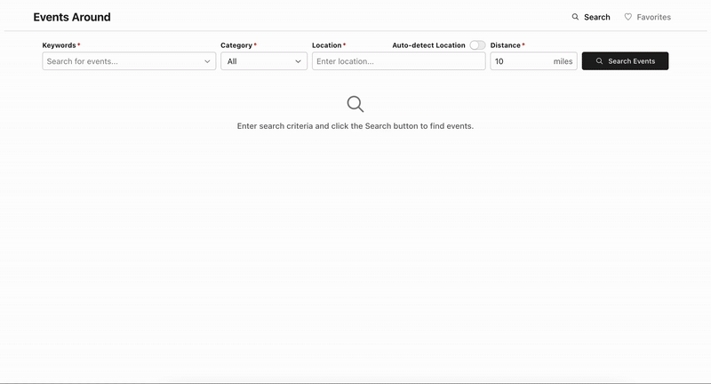

# Event Search

An event search app powered by Ticketmaster that allows a user to search for events, view event information, and save events by adding them to favorites.

[Visit Website](https://event-search2-477705.wl.r.appspot.com)

## Features

- Search for events by keywords, category, location, and distance
- View event and venue details
- View music artist stats and discography
- Share event on social media
- Go to event ticket purchasing page
- Add/remove events to favorites
- View favorited events

## Preview

## Tech Stack

| Category | Tech |
| ------ | ------ |
| Backend | Node.js, Express, MongoDB |
| Frontend | React, Radix |
| API | Ticketmaster |
